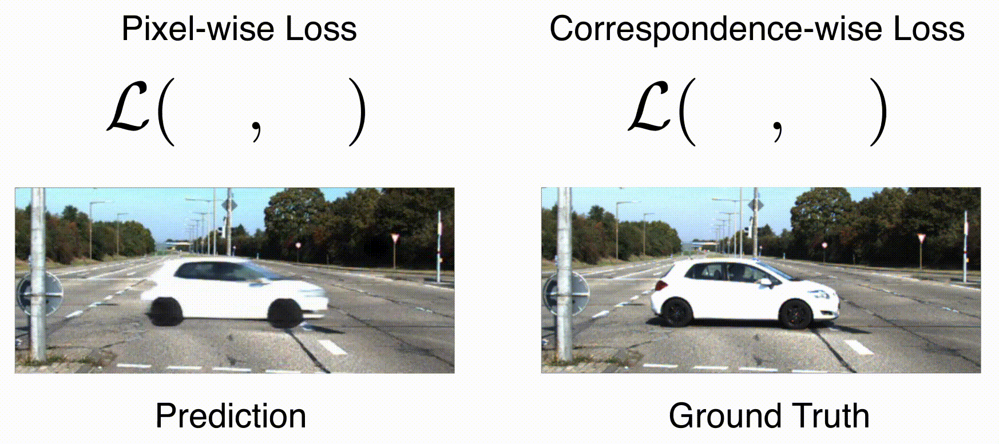

# Correspondence-wise Losses

### [[Arxiv]](https://arxiv.org/abs/2104.09498) | [[Website]](https://dangeng.github.io/CorrWiseLosses/)

Comparing Correspondences: Video Prediction with Correspondence-wise Losses
[Daniel Geng](https://dangeng.github.io/), [Max Hamilton](https://johnmaxh.github.io/), [Andrew Owens](http://andrewowens.com/)
CVPR, 2022



We propose correspondence-wise losses, which align images _before_ calculating an arbitrary loss. In our [paper](https://arxiv.org/abs/2104.09498) we show that this results in improvements to image synthesis tasks and provides robustness to spatial uncertainty.

### Code

Code and additional information can be found in the `code` directory.

### Citation

If you found this code useful please consider citing our [paper](https://arxiv.org/abs/2104.09498):

```
@inproceedings{geng2022correspondences,
  title={Comparing Correspondences: Video Prediction with Correspondence-wise Losses},
  author={Geng, Daniel and Hamilton, Max and Owens, Andrew},
  booktitle={CVPR},
  year={2022}
}
```

### Acknowledgements

DG is supported by a National Science Foundation Graduate Research Fellowship under Grant No. 1841052.

